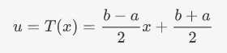
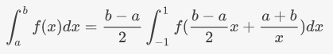
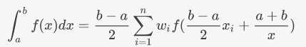
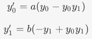
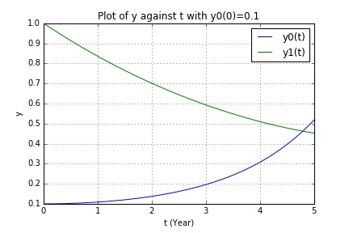
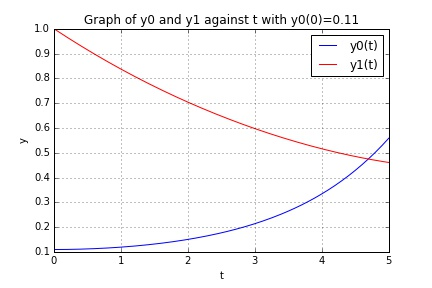

UECM3033 Assignment #3 Report
========================================================

- Prepared by: **Wong Chun Weng**
- Tutorial Group: T2

--------------------------------------------------------

## Task 1 --  Gauss-Legendre formula

The reports, codes and supporting documents are to be uploaded to Github at: 

[https://github.com/wongcw30utar/UECM3033_assign3](https://github.com/wongcw30utar/UECM3033_assign3)

####Explain how you implement your `task1.py` here.
In order to apply Gaussian Quadrature rule, an integral over [a, b] have to be transformed into the form of [-1, 1]. The interval can be transform by the following equations:

By applying the Gaussian Quadrature rule then approximation of the result is obtained.

After knowing the theory behind, the computations is converted into python code as below:

`y = (b-a)*x/2 + ((b+a)/2)`
 
`ans = ((b-a)/2)*sum(w*f(y))`

####Explain how you get the weights and nodes used in the Gauss-Legendre quadrature.

$$ x_i $$ and $$ w_i $$ can be obtained by module of polynomial.

`x,w = np.polynomial.legendre.leggauss(n)`

---------------------------------------------------------

## Task 2 -- Predator-prey model

####Explain how you implement your `task2.py` here, especially how to use `odeint`.

An ODE system is defined, in this case which is `bio_sys`, with the following differential equations:

Also, the initial values condition is defined:
initial_y = [0.1, 1.0]

Moreover, the time interval is defined from 0 to 5 years with the function `linspace` to smooth the line graph. This can be done as following code:

`t = np.linspace(0,5,150)`

The `odeint` module is used to solve ODE system as follow:

`sol_p1 = odeint(bio_sys, initial_y, t, args=(a,b))`

Put your graphs here and explain.

Let y0 be the number of prey, and y1 be the number of predator.

The plot above shows number of prey and number predator against year, t when the initial value condition, `y(0) = 0.1`. It can be seen that the number of prey increases over year but number of predator decrease over year.

The plot above shows te relationship of number of prey and number of predator. It can be seen that there is a inverse relationship between number of prey and number of predator.

####When the initial value condition, `y(0) = 0.11`

The plot above shows number of prey and number predator against year, t when the initial value condition, `y(0) = 0.11`. Similarly, it can be seen that the number of prey increases over year but number of predator decrease over year.

The plot above shows te relationship of number of prey and number of predator. Similarly, it can be seen that there is a inverse relationship between number of prey and number of predator.

####Is the system of ODE sensitive to initial condition? Explain.
No, this system of ODE is not sensitive to the initial condition. It can be seen that there is only a minor changes from the plots above when the initial value condition changed from `0.1` to `0.11`. We can say that the difference is not significant enough, therefore, this system of ODE is not sensitive to the initial condition.

-----------------------------------

last modified: change your date here
